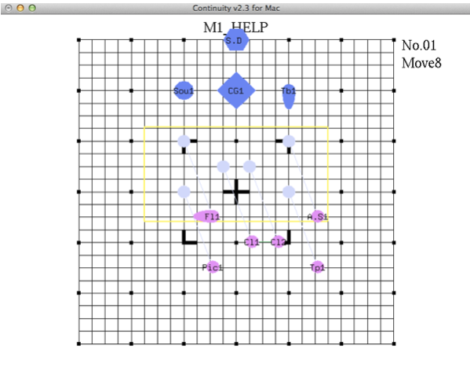

# コンテ作成補助プログラム

マーチング用のコンテを作成するプログラムです。

## 新規作成

### 初期設定

実行すると
開くファイル名を入力してください
と表示されるのでファイル名を入力します

> 入力例 : M1_HELP

M1_HELP.con が存在しないので新規作成します.
メンバー数を入力してください.

と表示されますのでメンバー数を半角の数字で入力してください。最大値は 50 です。

> 入力例 : 10

> メンバー 1 の名前を入力>>

と表示されるので名前を入力していきます。半角英数 4 文字以内で入力します

例

> メンバー 1 の名前を入力>>Cl1
> メンバー 2 の名前を入力>>Cl2
> メンバー 3 の名前を入力>>Pic1
> メンバー 4 の名前を入力>>Fl1
> メンバー 5 の名前を入力>>A.S1
> メンバー 6 の名前を入力>>Tp1
> メンバー 7 の名前を入力>>Tb1
> メンバー 8 の名前を入力>>Sou1
> メンバー 9 の名前を入力>>CG1
> メンバー 10 の名前を入力>>\*S.D

### 名前について

Flute, Trombone, Sousaphone, Color Guard, Battery には特殊な形を用意しています。

判定条件

- Flute 　 → 　前 2 文字が Fl , FL , fl
- Trombone 　 → 　前 2 文字が Tb , TB , tb
- Sousaphone 　 → 　前 2 文字が So , SO , so
- Color Guard 　 → 　前 2 文字が CG , C. , cg
- Battery 　 → 　始めに*がついている(*S.D と入力した場合、コンテ上では S.D と表示されます)

※これらの形は警告を出す距離を変えてあります。
※名前は後からでも容易に変更できます。

入力が完了すると
の様な画面が表示されます。入力した名前の図形が並んでいます。
ウィンドのサイズは初期では 800\*600 に設定してます。

## 操作方法

### 初期位置を決める

ドラック＆ドロップで場所を変更できます。

### 次のコンテへ

右クリックして出てくるメニューで「次のコンテ」をクリックするかショートカットキー「n」を押すと次のコンテになります。
元の場所も薄く表示されます。様々な線で補助線や警告を出してくれます。
移動させていない図形は濃い青、移動させた図形は薄い青になります。
これを繰り返しコンテを仕上げていきます。

### 線について

緑色の線
近い図形と自動的に結ばれ形が分かりやすくなります。1 つの図形だけ半歩ずれていたりした時に発見しやすいです。

黄色の線
少し近いんじゃないかな〜って思う距離です。いけると思ったらいけます。少し危ないと思えば少し危ないです。

赤色い線
かなり近くないですか？本当にそれでいいんですか？って思う距離です。なるべく出てこないようにしてください。

水色の線
前のコンテからの移動の線です。これが黄色になると Move 数に対して少し歩きすぎている可能性があります。

### Move 数の変更

Move 数を変更する為には右クリックメニューの Move 数(M)のサブメニューから希望の Move 数を選んでください。奇数やここにない Move 数にしたい場合はショートカットキー m を押してください。

Move 数を入力してください.Halt の場合は負の値にしてください．

Move16 にしたければ

> 16

Halt64 にしたければ

> -64

と入力してください。

### テンポの変更

テンポを変更するときは右クリックメニューのテンポ(T)のサブメニューから選択してください。
ここに存在しないテンポにするときは t キーをおしてください。

テンポを入力してください.

と黒い画面の方に表示されるので好きに入力してください。

### 入力を楽にする為に

入力を楽にする為に少しだけツールを用意しています。
範囲選択、複数選択、リセットです。

範囲選択について
まとめて移動させる時に使います。
表示されている図形から少し離れた所をクリックしてそのままドラックすると黄色い四角が表示されます。その四角の中の図形の色が変わり複数選択された状態になります。その状態から四角の中からドラック＆ドロップする事によりまとめて動かせます
四角の外をクリックすれば選択は解除されます

複数選択
範囲選択と同様です。
control キーを押しながら図形をクリックすると複数選択されます。いくつか選択した後で control を押したまま図形を移動させると範囲選択のときと同様まとめて移動させれます。また範囲選択した後で複数選択で追加する事もできます。

リセット
入力を間違えたときややり直したい時に使います。
右クリックのメニューから初期位置に戻す(r)を選択するか、ショートカットキー r を押す事で発動します。

範囲選択 or 複数選択中 → 選択された図形を初期位置に戻す
1 つだけ移動させた後 → 最後に移動させた図形だけを初期位置に戻す
何も無い所をクリックしてから押す → 全図形を初期位置に戻す

## 再生

### 再生

右クリックメニューの 1 枚再生(p)またはショートカットキー p を押す事によりそのコンテを図形が動いて再生できます。

### 逆再生

右クリックメニューの 1 枚逆再生(＠)またはショートカットキー＠を押す事によりそのコンテを図形がのろのろ動いて逆再生できます。

※再生、逆再生の時にスペースキーを押すとその場で再生をストップできます。

### 全再生

右クリックメニューの 1 枚全再生(P)またはショートカットキー P(shift+p)を押す事によりそのコンテから最後まで図形がむにゅむにゅ動いて再生されます。最後の確認等にご使用ください。一応スペースで停止できるかも・・・

## 保存と終了

### 保存

右クリックメニュー → 保存(s)またはショートカットキー s で保存できます。
save
M1_HELP ほぞんかんりょう
おつかれさまでした(´･ω･` )

と表示されたら保存成功です。いつエラーが起こるか分からないのでこまめに保存しておきましょう(普遍の真理)

成功すると M1_HELP.con というファイルが生成されます。バイナリファイルではなくテキストファイルなので中を見て頂ければ大体分かるかな・・・
このファイルを弄る事でなかなか弄れない所も弄れます。

### 終了

どのような方法で終了してくれても構いません。保存したかどうかは自分で確認しましょう。
一応右クリックメニュー → 終了(q)またはショートカットキー q またはウィンドウの × をクリックをお勧めします。タスクマネージャーからの強制終了や電源ブチッという方法でも構いません。(ただし自己責任でお願いします。)

## 右クリックメニューメニューとショートカットキー

### 概略

右クリックで

の様なメニューが表示されます。困ったら右クリックしてみましょう！
このメニューはほぼ全てショートカットキーを対応させているのでよく使うものは覚えると楽です。

### 各詳細

メニューを順に説明していきます　[　]の中はショートカットキーです。大文字小文字の違いにも注意してください。小文字で書かれているものは基本大文字でも大丈夫です。

＊次のコンテ(N)　[n]
そのままです。ただしむやみやたらに連打して No50 を越えないように気をつけてください。どうなっても知りません(笑)

＊前のコンテ(B)　[b]
前のコンテに戻ります。こちらは連打しても特に何もありません。

＊初期位置に戻す(r)　[r]
選択されている図形をそのコンテの初期位置に戻します。

範囲選択 or 複数選択中 → 選択された図形を初期位置に戻す
1 つだけ移動させた後 → 最後に移動させた図形だけを初期位置に戻す
何も無い所をクリックしてから押す → 全図形を初期位置に戻す

＊1 枚再生(p)　[p]
現在のコンテを再生します。スペースキーで止まったりします。

＊1 枚逆再生(@)　[@]
現在のコンテを逆再生します。スペースキーで止まったりします。

＊全再生(P)　[P]
現在のコンテから最後まで再生します。スペースキーで止まるかも！?

＊コメント入力(c)　[c]
コンテにコメントを入力します。
入力すると Move の下かテンポのしたに表示されます。
選択すると黒い方のウィンドウに
コメントを入力
＞

と表示されるのでスペース無しで適当に入れてやってください。あんまり長いと途中で切れます。(フルスクリーンにすると少しましになったりならなかったり)

例

ここらへんに入力したコメントが表示されます。

＊Move 数(M)　[m]
Move 数の変更。任意設定したい場合は m を押していい感じにしてください。

＊テンポ(T)　[t]
テンポの変更。任意設定したい場合は t を押してうまいことやってください。

＊その他設定
自動位置補正切替(a)　[a]
初期設定だと図形の位置が 0.5 歩間隔に補正されますがこれを押すとその補正をストップすることができます。主に曲線のコンテを描く時に使ってください。

名前の変更(_)　[_]
選択中の図形の名前を変更します。おすと
名前の変更:Cl1->

と黒い方のウィンドウに表示されるので入力してください。これによって楽器の形状や線の色が変わったりするかもしれません。
ちなみに範囲選択していると全員の名前を変える事になります。

補助線切替(-)　[-]
コンテは 1 歩間隔で線が引かれていますがこれを選択すると 0.5 歩間隔の細かい線が表示されます。個人的にはあまり必要ありません
♪(´ε ｀ )

フルスクリーン(v)　[v]
そのままです(笑)
出力する時に使うといい感じになります。

楽器の形状変更(f)　[f]
各図形はその楽器により形を変えていますがこれで切り替えると例外無くすべて ◯ で表示します。変な形が気に喰わない方にオススメ！

最初のコンテ(O)　[o]
最後のコンテ(L)　[l](エル)
ご想像にお任せします

＊コンテサイズ切替
夏ドリ
春コン
SAYAKA
の 3 種類ご用意しております。お好きなものをお選びください。
夏ドリ、春コン　 ⇆ 　 SAYAKA
で変更した時に若干図形の位置が変わりますが気にしないでください。バグじゃない仕様だ(言い訳)

＊編集
このコンテより後を全て削除
このコンテのみ削除
このコンテの後ろに 1 枚追加

の 3 つあります。これらにはショートカットキーは対応させていないのでメニューから使ってください。あまり使う機会は無いと思いますがいつか使いたいときが来るかもしれません。

＊保存(S)　[s]
保存します。ファイルは常に上書き保存されるので気をつけてください。

＊出力(K)　[K]
ビットマップ形式でファイルを出力します。印刷用です。

こんな感じの画像ファイルが大量に生成されます。最後に壊れたファイルが生成されるかもしれませんが気にせずにそっとゴミ箱に葬ってください。

＊終了(Q)　[q]
終了します。ただそれだけ。保存していなくとも警告を出さずに無慈悲に終了します。

## その他

免責事項
作成者は本プログラムの利用において生じたいかなる損害に対しても責任を負いません。

注意事項
不特定多数の人に公開しなければ自由に配布してくださって構いません。
曲線の移動(Follow The Leader)には対応していないので脳内再生で頑張ってください。
色々細かい所や設定を変更したい場合はソースコードを添付してあるのでうまい弄ってください。初めて作った C++＆OpenGL のプログラムなので読みにくいと思います。
テンポを 120 にしていても演算速度などの都合で若干ずれるかもしれません・・・頑張って調整してください。
